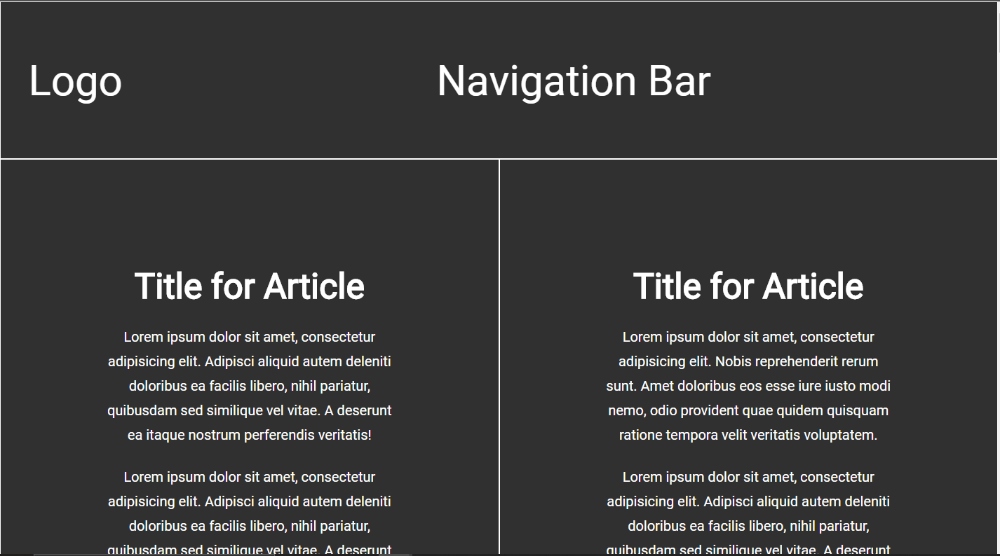

# Design Teardown

> This project consists of building a Heat-map of the [Smashing Magazine](https://www.smashingmagazine.com/) like a practice of UX design.

You can find the original description in [The Odin Project](https://www.theodinproject.com/courses/html5-and-css3/lessons/design-teardown)

## Built With

- HTML, CSS3

## Live Demo

[Live Demo Link](https://rawcdn.githack.com/oscardelalanza/Design-TearDown/23e6386beededd1273bf8ad8029a86fcc7cd0034/index.html)

## Getting Started

The goal of this exercise is to start training and thinking in terms of visual hierarchy, typography, and design principles. 
We created a grayscale heat map of the website that indicates which elements have the greatest weight in the visual hierarchy.

> To get a local copy up and running follow these simple example steps.

### Prerequisites

- `Git`

### Setup

To clone the project into your local environment do the following.

- Open a new `terminal` window and navigate to the directory where the project will be stored.
- Run the command `git clone git@github.com:oscardelalanza/Design-TearDown.git`.
- Run the command `cd Design-TearDown` to enter to the project directory.

### Install

- This project doesn't require installation, node modules, or similar.

### Usage

*This project is an HTML form template. Is only demonstrative and does not contain functional features.*

### Run tests

- This project doesn't contain tests.

### Deployment

- Open `index.html` file to go directly to the page, or use your preferred web server.

## Authors

👤 **Bruna Genz**

- Github: [@bruna-genz](https://github.com/bruna-genz)
- Twitter: [@Bruna_GK](https://twitter.com/Bruna_GK)
- Linkedin: [Bruna Genz](https://www.linkedin.com/in/brunagenz/)

👤 **Oscar De La Lanza**

- Github: [@oscardelalanza](https://github.com/oscardelalanza)
- Twitter: [@oscardelalanza](https://twitter.com/oscardelalanza)
- Linkedin: [Oscar De La Lanza](https://linkedin.com/in/oscardelalanza)
- Email: oscardelalanza@gmail.com

## 🤝 Contributing

Contributions, issues and feature requests are welcome!

## Show your support

Give a ⭐️ if you like this project!
